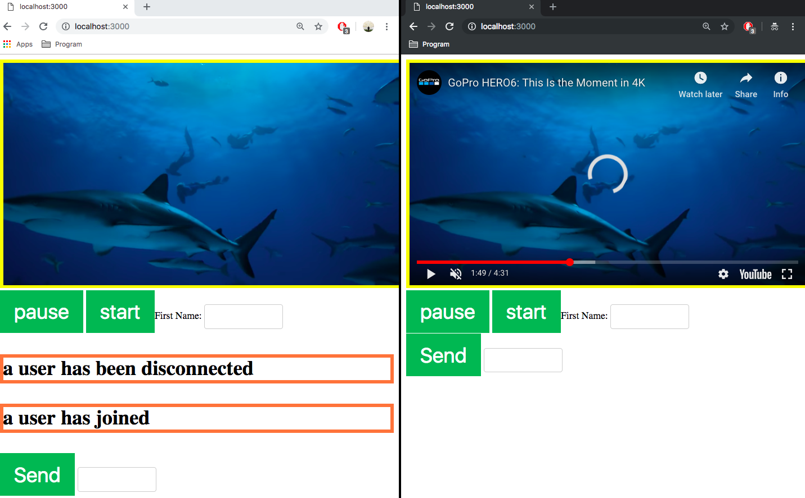

# Socket_io_media

https://socket.io/
# 1. About socket_io_media Project

## 1.1. Real-time Buttons to play or stop the video
- Multiple clients can share the video using two buttons (stop or play).
- If a client clicks on stop button, the video that rest of clients watching will be stopped.
- Play button works the same way.

## 1.2. Instant messaging and chat
- Socket_io_media includes a real-time chat application.
- This chat application has some features.
- client can register username
- client can be notified when other client leave or join the chat room

## 1.3. Binary streaming
- when client clicks on specific time-frame of the video, other would watch the same part that starts with the spcific time-frame.
- By using this streaming feature, clients can share ideas showing their spcific moment of the video.

</img>
